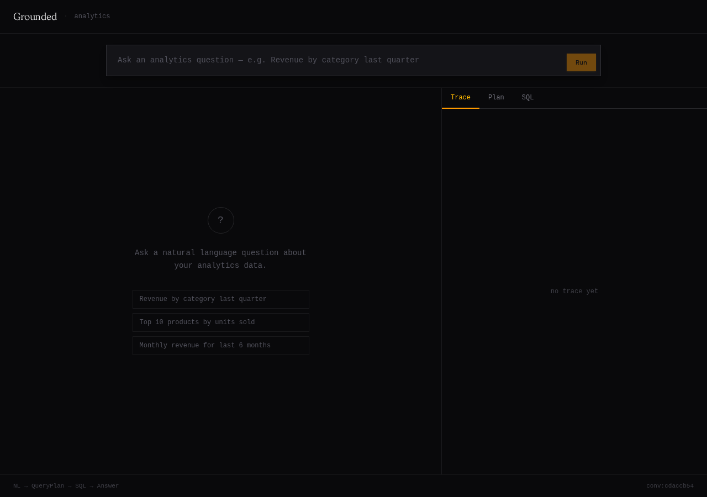
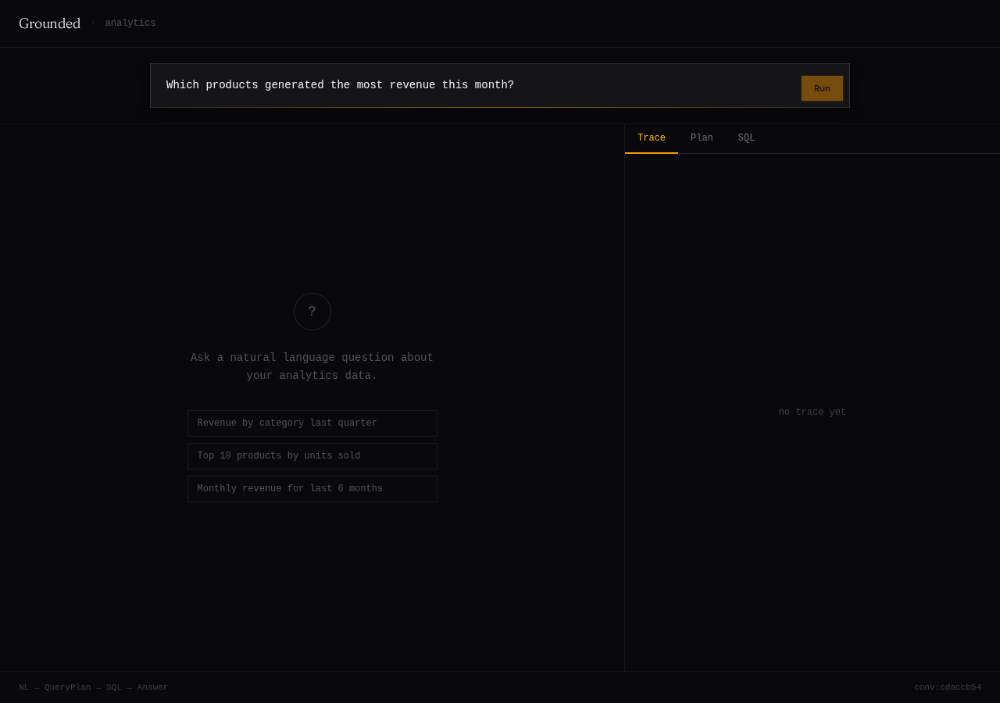
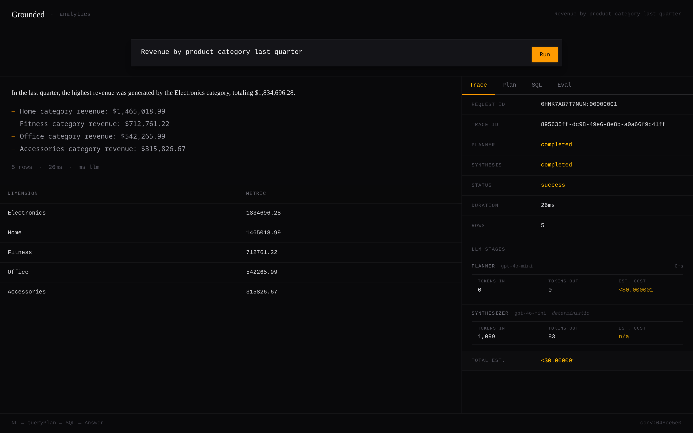
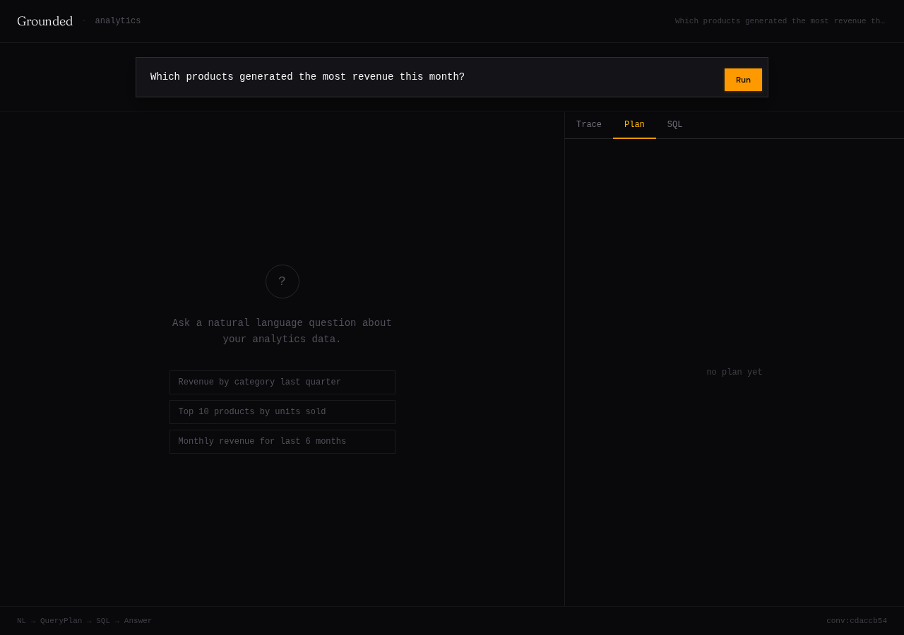
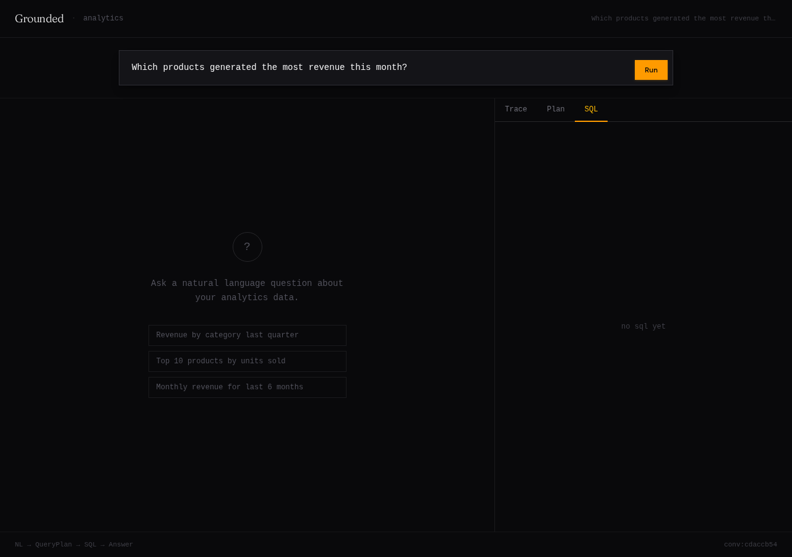

# Grounded

A focused demonstration of production-grade LLM integration patterns for an analytics backend.

The core thesis: LLMs should produce *structured intent*, not free-form SQL or prose. Everything downstream — compilation, execution, synthesis — is deterministic, validated, and testable without touching an API.

---

## What it does

A user asks a natural-language analytics question. The system:

1. **Plans** — converts the question into a typed `QueryPlan` (metric, dimension, filters, time range, sort) via an LLM using OpenAI Structured Outputs
2. **Validates** — enforces allowlists on every field before anything touches the database
3. **Compiles** — translates the plan into a parameterized SQL query via a fragment registry; no string interpolation
4. **Guards** — runs a second-pass SQL safety check to block multi-statement queries and disallowed keywords
5. **Executes** — runs the query against Postgres via Npgsql
6. **Synthesizes** — calls an LLM with the result rows to produce a grounded natural-language answer
7. **Evaluates** — scores the answer for execution success, structural correctness, and grounding against the actual data

```
Question
   ↓
ILlmPlannerGateway → QueryPlan (via Structured Outputs)
   ↓
QueryPlanValidator (allowlist enforcement)
   ↓
QueryPlanCompiler + SqlSafetyGuard
   ↓
AnalyticsQueryExecutor (Postgres / Npgsql)
   ↓
ILlmGateway → AnswerDto
   ↓
ScoringService + RegressionComparer
```

---

## Why this architecture

**LLMs never emit SQL.** The planner produces a structured `QueryPlan` record via OpenAI Structured Outputs (enforced JSON Schema). SQL is generated by a deterministic compiler from a registry of pre-approved fragments. User-influenced values only reach the database as Npgsql parameters. The safety guard is defense-in-depth, not the primary control.

**LLM outputs are grounded, not trusted.** The synthesizer receives result rows. It cannot query the database, invent metrics, or modify the plan. The `AnswerOutputValidator` enforces required fields. Scoring checks that the answer summary contains at least one value traceable to the actual result rows.

**Both LLM seams are injectable.** `ILlmPlannerGateway` and `ILlmGateway` are interfaces. The pipeline runs, tests, and evaluates in deterministic mode (no API keys or network access required). Swapping in a real OpenAI or Anthropic implementation is a one-class change.

**Tests are integration tests.** All tests use `WebApplicationFactory` and exercise the full HTTP → service → synthesis path. No internal mocking.

**API guardrails are built in.** All LLM calls enforce `temperature=0`, `max_tokens=500`, and a configurable timeout (default 15 s). The planner uses Structured Outputs (strict JSON Schema) so the LLM cannot deviate from the `QueryPlan` shape.

---

## API

Live interactive docs are available at **`http://localhost:5252/scalar/v1`** when the API is running.
The raw OpenAPI 3.1 spec is at **`http://localhost:5252/openapi/v1.json`** or in [`openapi.yaml`](openapi.yaml).

### `POST /analytics/query`

Ask a natural-language question. The LLM planner converts it to a `QueryPlan`, which is validated, compiled, executed, and synthesized into a grounded answer.

```json
{
  "question": "Which products generated the most revenue last month?",
  "conversationId": "session-abc123"
}
```

`conversationId` is optional. Pass the same value across follow-up questions to enable conversation continuity.

**Response:**

```json
{
  "status": "success",
  "rows": [{ "dimension": "Widget Pro", "metric": 48200.00 }],
  "metadata": { "compiledSql": "SELECT ...", "rowCount": 5, "durationMs": 42 },
  "answer": {
    "summary": "Widget Pro led revenue last month at $48,200.",
    "keyPoints": ["Widget Pro: $48,200", "Gadget X: $31,500"],
    "tableIncluded": true
  },
  "trace": { "plannerStatus": "completed", "synthesisStatus": "completed", ... }
}
```

**HTTP status codes:** `200` success, `400` invalid request, `422` business validation failure (invalid metric, unsupported filter, etc.), `500` unexpected error.

### `POST /analytics/query-plan`

Execute a pre-built `QueryPlan` directly, bypassing the LLM planner. Use for deterministic integration tests or programmatic plan construction.

```json
{
  "queryPlan": {
    "version": "1.0",
    "questionType": "ranking",
    "metric": "revenue",
    "dimension": "product_name",
    "filters": [],
    "timeRange": { "preset": "last_30_days", "startDate": null, "endDate": null },
    "timeGrain": null,
    "sort": { "by": "metric", "direction": "desc" },
    "limit": 5,
    "usePriorState": false
  },
  "userQuestion": "Which products generated the most revenue this month?"
}
```

### `POST /analytics/eval`

Run the full benchmark suite (`eval/benchmark_cases.jsonl`) through the live pipeline. Returns per-case scores and a regression comparison against the previous run.

```json
{
  "run": {
    "score": 0.87,
    "summary": {
      "plannerValidityRate": 1.0,
      "executionSuccessRate": 0.95,
      "groundingRate": 0.90
    },
    "caseResults": [{ "caseId": "agg_revenue_last_month", "passed": true, "score": 1.0 }]
  },
  "comparison": { "hasRegression": false, "scoreDelta": 0.02, "notes": [] }
}
```

### Supported metrics and filters

**Metrics:** `revenue`, `order_count`, `units_sold`, `average_order_value`, `new_customer_count`

**Filter fields:** `customer_region`, `customer_segment`, `acquisition_channel`, `product_category`, `product_subcategory`, `product_name`, `sales_channel`, `shipping_region`, `customer_type`

**Time range presets:** `last_7_days`, `last_30_days`, `last_90_days`, `last_6_months`, `last_12_months`, `month_to_date`, `quarter_to_date`, `year_to_date`, `last_month`, `last_quarter`, `last_year`, `all_time`, `custom_range`

---

## Running locally

**Prerequisites:** .NET 10, Docker, Python 3 (`psycopg2-binary`)

### 1. Start the database

```bash
cp .env.example .env          # set POSTGRES_PASSWORD
bash scripts/db-up.sh         # starts Postgres 17 in Docker, waits for healthy
```

Seed the analytics data (~3k customers, 180 products, 18k orders):

```bash
pip install psycopg2-binary
python3 scripts/seed.py --dsn "Host=127.0.0.1;Port=5432;Database=grounded;Username=grounded;Password=<your-password>"
```

Helper scripts: `db-down.sh`, `db-reset.sh`, `db-logs.sh`. See `database/README.md`.

### 2. Configure the API

Create `Grounded.Api/appsettings.Local.json` (git-ignored):

```json
{
  "ConnectionStrings": {
    "AnalyticsDatabase": "Host=127.0.0.1;Port=5432;Database=grounded;Username=grounded;Password=<your-password>"
  }
}
```

### 3. Configure LLM access (optional)

To use a real LLM, set environment variables before running the API:

| Variable | Default | Description |
|---|---|---|
| `GROUNDED_PLANNER_MODEL` | — | Model name, e.g. `gpt-4o-mini` |
| `GROUNDED_PLANNER_API_KEY` | — | API key |
| `GROUNDED_PLANNER_BASE_URL` | `https://api.openai.com/v1/` | OpenAI-compatible base URL |
| `GROUNDED_PLANNER_TIMEOUT_SECONDS` | `15` | Per-request timeout |

Without these variables the pipeline runs in deterministic mode (no API calls).

The planner uses **Structured Outputs** (`response_format: json_schema`, `strict: true`) with a fixed JSON Schema for `QueryPlan`. Temperature is locked to `0` and `max_tokens` to `500`.

### 4. Run the API

```bash
bash scripts/api-run.sh
# API: http://localhost:5252
# Scalar UI: http://localhost:5252/scalar/v1
# OpenAPI spec: http://localhost:5252/openapi/v1.json
```

`api-run.sh` sources `.env` and exports all variables before starting the API, so `GROUNDED_PLANNER_*` keys are picked up automatically. You can also `cd Grounded.Api && dotnet run` if you've already exported the variables in your shell.

### 5. Run the frontend

```bash
cd grounded-ui
npm install
npm run dev
# UI: http://localhost:5173
```

The dev server proxies `/analytics/*` to `http://localhost:5252`.

### 6. Run tests (no database required)

```bash
dotnet test Grounded.slnx
```

---

## UI

The `grounded-ui` React frontend provides a split-pane interface: left panel shows the answer and result table, right panel exposes execution internals via three tabs.

**Empty state** — query input with example prompts:



**Question typed** — natural-language input ready to submit:



**Trace tab** — execution metadata (request ID, planner status, duration, LLM latency, row count):



**Plan tab** — the `QueryPlan` JSON produced by the planner, showing exactly what the LLM generated before any SQL was compiled:



**SQL tab** — the parameterized SQL compiled from the plan by `QueryPlanCompiler`, never generated by the LLM:



---

## Scoring

Each benchmark case is scored across three dimensions:

| Dimension | Weight | Passes when |
|---|---|---|
| Execution success | 0.5 | Query ran without error |
| Structural correctness | 0.3 | Answer has a non-empty summary and at least one key point |
| Answer grounding | 0.2 | Summary contains at least one value present in the result rows |

`Passed = executionSuccess AND structuralCorrectness`. Regression is detected when a case that passed on the previous run fails on the current run.

---

## Project structure

```
Grounded.Api/
  Controllers/
    AnalyticsController.cs       # POST /analytics/query, /query-plan, /eval
  Models/
    Contracts.cs                 # QueryPlan, ExecuteQueryPlanResponse, EvalResponse, ...
    TraceModels.cs               # ModelRequest, ModelResponse, ModelInvocationResult
    Answering.cs                 # AnswerDto, QueryExecutionTrace
    EvalModels.cs                # BenchmarkCase, BenchmarkCaseResult, EvalRun, ...
    AnswerSynthesizerModels.cs   # AnswerSynthesizerRequest/Response
  Services/
    AnalyticsQueryPlanService.cs # Pipeline orchestrator
    QueryPlanValidator.cs        # Allowlist enforcement
    QueryPlanCompiler.cs         # QueryPlan → parameterized SQL
    QueryPlanSchema.cs           # JSON Schema for planner Structured Outputs
    SqlFragmentRegistry.cs       # Pre-approved SQL fragment registry
    SqlSafetyGuard.cs            # Second-pass SQL safety check
    TimeRangeResolver.cs         # Preset time range → UTC bounds
    AnalyticsQueryExecutor.cs    # Npgsql execution
    AnswerSynthesizer.cs         # LLM synthesis orchestrator
    AnswerOutputValidator.cs     # Synthesis output validation
    DeterministicAnswerSynthesizerEngine.cs  # Deterministic synthesis (no API required)
    ModelInvoker.cs              # IModelInvoker + OpenAI-compatible + replay + deterministic
    LlmGateway.cs                # ILlmGateway + ILlmPlannerGateway + OpenAI adapters
    OpenAiCompatiblePlannerGateway.cs  # Planner gateway with Structured Outputs
    PromptStore.cs               # Prompt loading + SHA-256 versioning
    ConversationStateService.cs  # Conversation state management
    TraceRepository.cs           # Npgsql trace persistence
    EvalRepository.cs            # Npgsql eval run persistence
    EvalRunner.cs                # Full pipeline eval execution
    BenchmarkLoader.cs           # JSONL benchmark case loader
    ScoringService.cs            # Per-case and aggregate scoring
    RegressionComparer.cs        # Cross-run regression detection
    SchemaInitializer.cs         # App schema + table creation on startup

Grounded.Tests/
  AnalyticsPhase2Tests.cs        # Integration tests: SQL shape, validation, HTTP contract
  Phase4IntegrationTests.cs      # Integration tests: synthesis, eval endpoint, regression

grounded-ui/                     # React + TypeScript frontend
  src/
    App.tsx                      # Split-pane layout
    components/                  # QueryInput, ResultPanel, TracePanel, ...

compose.yaml                     # Docker Compose: Postgres 17, named volume, healthcheck
database/
  init/001-schema.sql            # Analytics tables: customers, products, orders, order_items
  README.md                      # Database quick start
scripts/
  seed.py                        # Generates ~78k rows of realistic analytics data
  db-up.sh / db-down.sh / db-reset.sh / db-logs.sh

prompts/
  planner/v1.md                  # LLM planner system prompt
  answer-synthesizer/v1.md       # Synthesis prompt with grounding rules

eval/
  benchmark_cases.jsonl          # Benchmark dataset
  regression_history.json        # Written at runtime by RegressionComparer

openapi.yaml                     # OpenAPI 3.1 specification (hand-authored)
docs/
  adrs/                          # Architecture decision records
  infrastructure/                # Postgres Docker spec
  screenshots/                   # UI screenshots
  archive/                       # Finished implementation prompts and planning docs
```

---

## Database schema

The `grounded` PostgreSQL schema contains four analytics tables seeded with two years of e-commerce data:

- **`customers`** — region, segment, acquisition channel, customer type, join date
- **`products`** — category, subcategory, unit price
- **`orders`** — customer, date, channel, shipping region, status
- **`order_items`** — product, order, quantity, unit price

App-owned tables (traces, eval runs, conversation state) are created automatically in the app schema on startup by `SchemaInitializer`.

---

## Phases

| Phase | What was built |
|---|---|
| 1 | Domain model, QueryPlan contract, Postgres schema, seed data, benchmark dataset |
| 2 | Validation, SQL compilation, safety guard, execution pipeline, integration tests |
| 3 | LLM planner gateway, prompt store, SHA-256 versioning, conversation state |
| 4 | Answer synthesis, LLM gateway seam, eval harness, grounding-based scoring, regression comparison |
| 5 | Conversation state persistence, follow-up question resolution |
| + | Structured Outputs upgrade, OpenAPI 3.1 spec, Scalar UI, Docker Compose + seed, API guardrails |
