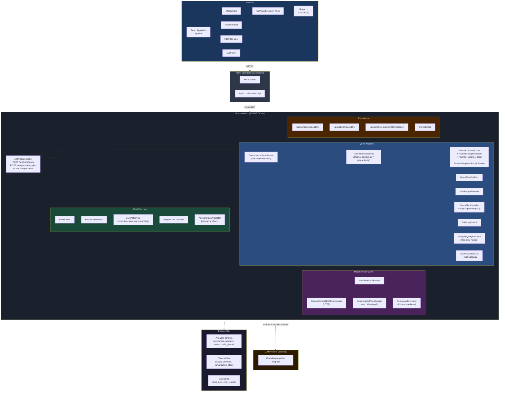

# Component Architecture Diagram

Internal layout of the Grounded system across its three deployable units.

```mermaid
flowchart TD
    subgraph Browser["Browser"]
        UI_APP["React App (Vite)\nApp.tsx"]
        QI["QueryInput"]
        AP["AnswerPanel"]
        IP["InternalsPanel"]
        EP["EvalPanel"]
        UQ["useAnalyticsQuery hook"]
        APILIB["lib/api.ts\npostQuery()"]

        UI_APP --> QI & AP & IP & EP
        QI --> UQ --> APILIB
    end

    subgraph Nginx["nginx (grounded-ui container)"]
        STATIC["Static assets"]
        PROXY["/api/* → Grounded.Api"]
    end

    subgraph GApi["Grounded.Api (ASP.NET Core)"]
        CTRL["AnalyticsController\nPOST /analytics/query\nPOST /analytics/query-plan\nPOST /analytics/eval"]

        subgraph Pipeline["Query Pipeline"]
            direction TB
            CS["ConversationStateService\n(follow-up detection)"]
            PG["ILlmPlannerGateway\n(OpenAI-compatible / deterministic)"]
            QPC["PlannerContextBuilder\n+ PlannerPromptRenderer\n+ PlannerResponseParser\n+ PlannerResponseRepairService"]
            QPV["QueryPlanValidator"]
            TRR["TimeRangeResolver"]
            COMP["QueryPlanCompiler\n+ SqlFragmentRegistry"]
            SSG["SqlSafetyGuard"]
            QEX["AnalyticsQueryExecutor\n(read-only Npgsql)"]
            AS["AnswerSynthesizer\n→ ILlmGateway"]
        end

        subgraph Invokers["Model Invoker Layer"]
            MIR["ModelInvokerResolver"]
            OAI["OpenAiCompatibleModelInvoker\n(HTTP)"]
            DET["DeterministicModelInvoker\n(no-LLM test path)"]
            REP["ReplayModelInvoker\n(fixture-based eval)"]
            MIR --> OAI & DET & REP
        end

        subgraph Eval["Eval / Scoring"]
            ER["EvalRunner"]
            BL["BenchmarkLoader"]
            SS["ScoringService\n(execution+structure+grounding)"]
            RC["RegressionComparer"]
            AOV["AnswerOutputValidator\n(grounding check)"]
        end

        subgraph Persistence["Persistence"]
            TR["NpgsqlTraceRepository"]
            EVR["NpgsqlEvalRepository"]
            CVR["NpgsqlConversationStateRepository"]
            PS["PromptStore"]
        end

        CTRL --> CS --> PG --> QPC
        CTRL --> Pipeline
        Pipeline --> Invokers
        CTRL --> Eval
        Eval --> Pipeline
        Pipeline --> Persistence
    end

    subgraph Postgres["PostgreSQL"]
        ANA["Analytics schema\n(customers, products, orders, order_items)"]
        TRC["Trace tables\n(traces, attempts, conversation_state)"]
        EVT["Eval tables\n(eval_runs, eval_results)"]
    end

    subgraph LLMExt["LLM Provider (external)"]
        OAIP["OpenAI-compatible endpoint"]
    end

    Browser -->|HTTPS| Nginx
    Nginx -->|proxy /api/*| GApi
    GApi --> Postgres
    GApi -->|Planner + Answer prompts| LLMExt

    style Browser fill:#1a365d,color:#e2e8f0
    style Nginx fill:#2d3748,color:#e2e8f0
    style GApi fill:#1a202c,color:#e2e8f0
    style Pipeline fill:#2b4c7e,color:#e2e8f0
    style Invokers fill:#4a235a,color:#e2e8f0
    style Eval fill:#1a4a3a,color:#e2e8f0
    style Persistence fill:#4a2500,color:#e2e8f0
    style Postgres fill:#1a1a2e,color:#e2e8f0
    style LLMExt fill:#2d1b00,color:#e2e8f0
```
