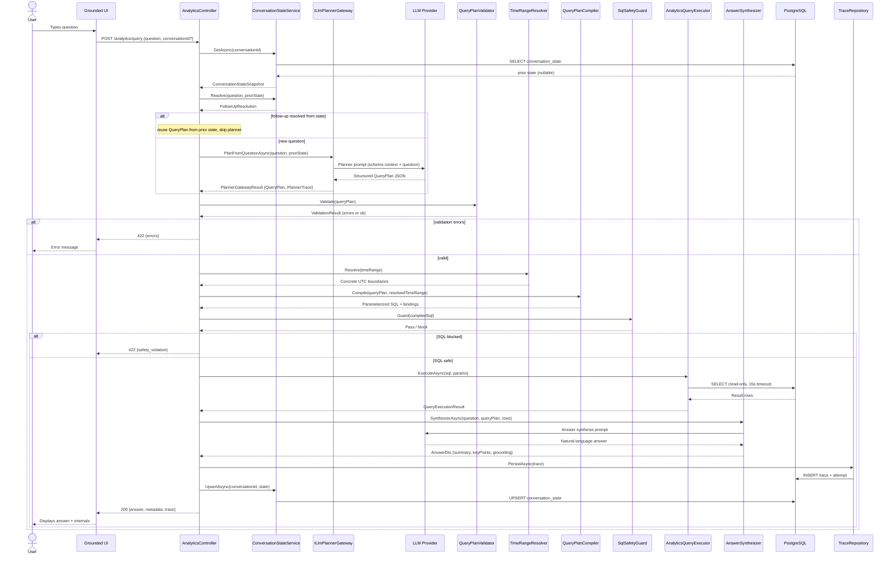

# Request Pipeline — Sequence Diagram

End-to-end flow for `POST /analytics/query` (natural-language question → grounded answer).

```mermaid
sequenceDiagram
    actor User
    participant UI as Grounded UI
    participant CTRL as AnalyticsController
    participant CSS as ConversationStateService
    participant PG as ILlmPlannerGateway
    participant LLM as LLM Provider
    participant QPV as QueryPlanValidator
    participant TRR as TimeRangeResolver
    participant COMP as QueryPlanCompiler
    participant SSG as SqlSafetyGuard
    participant QEX as AnalyticsQueryExecutor
    participant AS as AnswerSynthesizer
    participant DB as PostgreSQL
    participant TR as TraceRepository

    User->>UI: Types question
    UI->>CTRL: POST /analytics/query {question, conversationId?}

    CTRL->>CSS: GetAsync(conversationId)
    CSS->>DB: SELECT conversation_state
    DB-->>CSS: prior state (nullable)
    CSS-->>CTRL: ConversationStateSnapshot

    CTRL->>CSS: Resolve(question, priorState)
    CSS-->>CTRL: FollowUpResolution

    alt follow-up resolved from state
        Note over CTRL: reuse QueryPlan from prior state, skip planner
    else new question
        CTRL->>PG: PlanFromQuestionAsync(question, priorState)
        PG->>LLM: Planner prompt (schema context + question)
        LLM-->>PG: Structured QueryPlan JSON
        PG-->>CTRL: PlannerGatewayResult {QueryPlan, PlannerTrace}
    end

    CTRL->>QPV: Validate(queryPlan)
    QPV-->>CTRL: ValidationResult (errors or ok)

    alt validation errors
        CTRL-->>UI: 422 {errors}
        UI-->>User: Error message
    else valid
        CTRL->>TRR: Resolve(timeRange)
        TRR-->>CTRL: Concrete UTC boundaries

        CTRL->>COMP: Compile(queryPlan, resolvedTimeRange)
        COMP-->>CTRL: Parameterized SQL + bindings

        CTRL->>SSG: Guard(compiledSql)
        SSG-->>CTRL: Pass / block

        alt SQL blocked
            CTRL-->>UI: 422 {safety_violation}
        else SQL safe
            CTRL->>QEX: ExecuteAsync(sql, params)
            QEX->>DB: SELECT (read-only, 15s timeout)
            DB-->>QEX: Result rows
            QEX-->>CTRL: QueryExecutionResult

            CTRL->>AS: SynthesizeAsync(question, queryPlan, rows)
            AS->>LLM: Answer synthesis prompt
            LLM-->>AS: Natural-language answer
            AS-->>CTRL: AnswerDto {summary, keyPoints, grounding}

            CTRL->>TR: PersistAsync(trace)
            TR->>DB: INSERT trace + attempt
            CTRL->>CSS: UpsertAsync(conversationId, state)
            CSS->>DB: UPSERT conversation_state

            CTRL-->>UI: 200 {answer, metadata, trace}
            UI-->>User: Displays answer + internals
        end
    end
```
