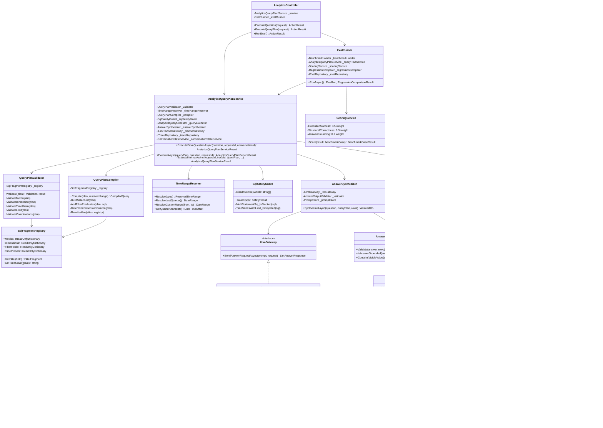

# Class Diagram — Key Services and Models

Core service relationships in `Grounded.Api`.

```mermaid
classDiagram

    %% ── Controller ───────────────────────────────────────────
    class AnalyticsController {
        -AnalyticsQueryPlanService _service
        -EvalRunner _evalRunner
        +ExecuteQuestion(request) ActionResult
        +ExecuteQueryPlan(request) ActionResult
        +RunEval() ActionResult
    }

    %% ── Orchestrator ─────────────────────────────────────────
    class AnalyticsQueryPlanService {
        -QueryPlanValidator _validator
        -TimeRangeResolver _timeRangeResolver
        -QueryPlanCompiler _compiler
        -SqlSafetyGuard _sqlSafetyGuard
        -IAnalyticsQueryExecutor _queryExecutor
        -AnswerSynthesizer _answerSynthesizer
        -ILlmPlannerGateway _plannerGateway
        -ITraceRepository _traceRepository
        -ConversationStateService _conversationStateService
        +ExecuteFromQuestionAsync(question, requestId, conversationId) AnalyticsQueryPlanServiceResult
        +ExecuteAsync(queryPlan, question, requestId) AnalyticsQueryPlanServiceResult
        -ExecuteInternalAsync(requestId, traceId, queryPlan, ...) AnalyticsQueryPlanServiceResult
    }

    %% ── Pipeline Services ────────────────────────────────────
    class QueryPlanValidator {
        -SqlFragmentRegistry _registry
        +Validate(plan) ValidationResult
        -ValidateMetric(plan)
        -ValidateDimension(plan)
        -ValidateTimeGrain(plan)
        -ValidateLimit(plan)
        -ValidateCombinations(plan)
    }

    class QueryPlanCompiler {
        -SqlFragmentRegistry _registry
        +Compile(plan, resolvedRange) CompiledQuery
        -BuildSelectList(plan)
        -AddFilterPredicates(plan, sql)
        -DetermineDimensionColumn(plan)
        -RewriteAlias(alias, registry)
    }

    class SqlFragmentRegistry {
        +Metrics: IReadOnlyDictionary
        +Dimensions: IReadOnlyDictionary
        +FilterFields: IReadOnlyDictionary
        +TimePresets: IReadOnlyDictionary
        +GetFilter(field) FilterFragment
        +GetTimeGrain(grain) string
    }

    class SqlSafetyGuard {
        +Guard(sql) SafetyResult
        -DisallowedKeywords: string[]
        -MultiStatementSql_IsBlocked(sql)
        -TimeSeriesWithLimit_IsRejected(sql)
    }

    class TimeRangeResolver {
        +Resolve(spec) ResolvedTimeRange
        +ResolveLastQuarter() DateRange
        +ResolveCustomRange(from, to) DateRange
        +GetQuarterStart(date) DateTimeOffset
    }

    %% ── LLM Planner Gateway ──────────────────────────────────
    class ILlmPlannerGateway {
        <<interface>>
        +PlanFromQuestionAsync(question, state) PlannerGatewayResult
    }

    class OpenAiCompatiblePlannerGateway {
        -ModelInvokerResolver _resolver
        -PlannerContextBuilder _contextBuilder
        -PlannerPromptRenderer _renderer
        -PlannerResponseParser _parser
        -PlannerResponseRepairService _repair
        +PlanFromQuestionAsync(question, state) PlannerGatewayResult
    }

    class DeterministicLlmPlannerGateway {
        +PlanFromQuestionAsync(question, state) PlannerGatewayResult
    }

    ILlmPlannerGateway <|.. OpenAiCompatiblePlannerGateway
    ILlmPlannerGateway <|.. DeterministicLlmPlannerGateway

    %% ── Answer Gateway ───────────────────────────────────────
    class ILlmGateway {
        <<interface>>
        +SendAnswerRequestAsync(prompt, request) LlmAnswerResponse
    }

    class DeterministicLlmGateway {
        -ModelInvokerResolver _resolver
        +SendAnswerRequestAsync(prompt, request) LlmAnswerResponse
    }

    ILlmGateway <|.. DeterministicLlmGateway

    %% ── Model Invoker ────────────────────────────────────────
    class IModelInvoker {
        <<interface>>
        +Name: string
        +InvokeAsync(request) ModelInvocationResult
    }

    class ModelInvokerResolver {
        -_invokers: IReadOnlyDictionary
        +GetRequired(name) IModelInvoker
    }

    class OpenAiCompatibleModelInvoker {
        +Name = "openai-compatible"
        +InvokeAsync(request) ModelInvocationResult
    }

    class DeterministicModelInvoker {
        +Name = "deterministic"
        -DeterministicAnswerSynthesizerEngine _engine
        +InvokeAsync(request) ModelInvocationResult
    }

    class ReplayModelInvoker {
        +Name = "replay"
        +InvokeAsync(request) ModelInvocationResult
    }

    IModelInvoker <|.. OpenAiCompatibleModelInvoker
    IModelInvoker <|.. DeterministicModelInvoker
    IModelInvoker <|.. ReplayModelInvoker
    ModelInvokerResolver --> IModelInvoker

    %% ── Answer Synthesizer ───────────────────────────────────
    class AnswerSynthesizer {
        -ILlmGateway _llmGateway
        -AnswerOutputValidator _validator
        -PromptStore _promptStore
        +SynthesizeAsync(question, queryPlan, rows) AnswerDto
    }

    class AnswerOutputValidator {
        +Validate(answer, rows) ValidationResult
        +IsAnswerGrounded(answer, rows) bool
        +ContainsVisibleValue(summary, rows) bool
    }

    %% ── Eval ─────────────────────────────────────────────────
    class EvalRunner {
        -BenchmarkLoader _benchmarkLoader
        -AnalyticsQueryPlanService _queryPlanService
        -ScoringService _scoringService
        -RegressionComparer _regressionComparer
        -IEvalRepository _evalRepository
        +RunAsync() EvalRun, RegressionComparisonResult
    }

    class ScoringService {
        +Score(result, benchmarkCase) BenchmarkCaseResult
        -ExecutionSuccess: 0.5 weight
        -StructuralCorrectness: 0.3 weight
        -AnswerGrounding: 0.2 weight
    }

    %% ── Relationships ────────────────────────────────────────
    AnalyticsController --> AnalyticsQueryPlanService
    AnalyticsController --> EvalRunner
    AnalyticsQueryPlanService --> QueryPlanValidator
    AnalyticsQueryPlanService --> QueryPlanCompiler
    AnalyticsQueryPlanService --> TimeRangeResolver
    AnalyticsQueryPlanService --> SqlSafetyGuard
    AnalyticsQueryPlanService --> AnswerSynthesizer
    AnalyticsQueryPlanService --> ILlmPlannerGateway
    QueryPlanValidator --> SqlFragmentRegistry
    QueryPlanCompiler --> SqlFragmentRegistry
    AnswerSynthesizer --> ILlmGateway
    AnswerSynthesizer --> AnswerOutputValidator
    DeterministicLlmGateway --> ModelInvokerResolver
    OpenAiCompatiblePlannerGateway --> ModelInvokerResolver
    EvalRunner --> AnalyticsQueryPlanService
    EvalRunner --> ScoringService
```
