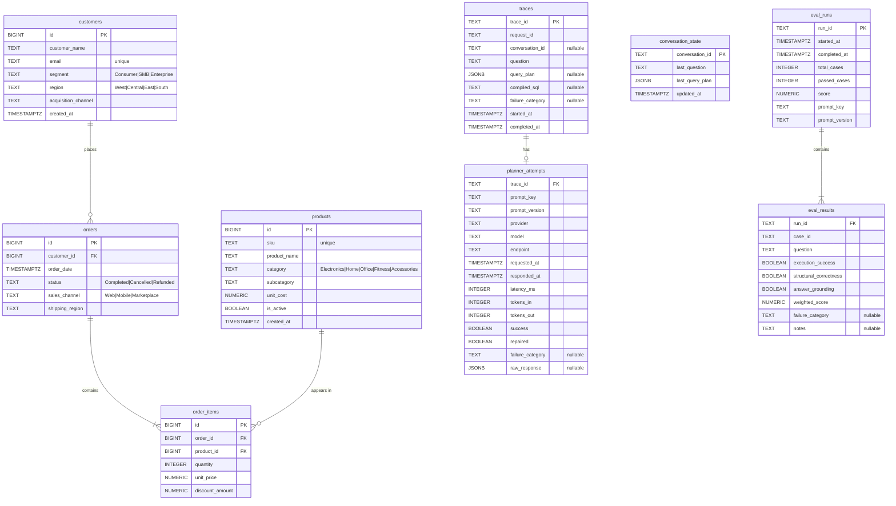

# Database Schema — ER Diagram

Grounded uses a single PostgreSQL instance with two logical schemas:
- **public** — analytics domain data (seeded, read-only at runtime)
- **grounded** — trace, eval, and conversation state (written by the API)

