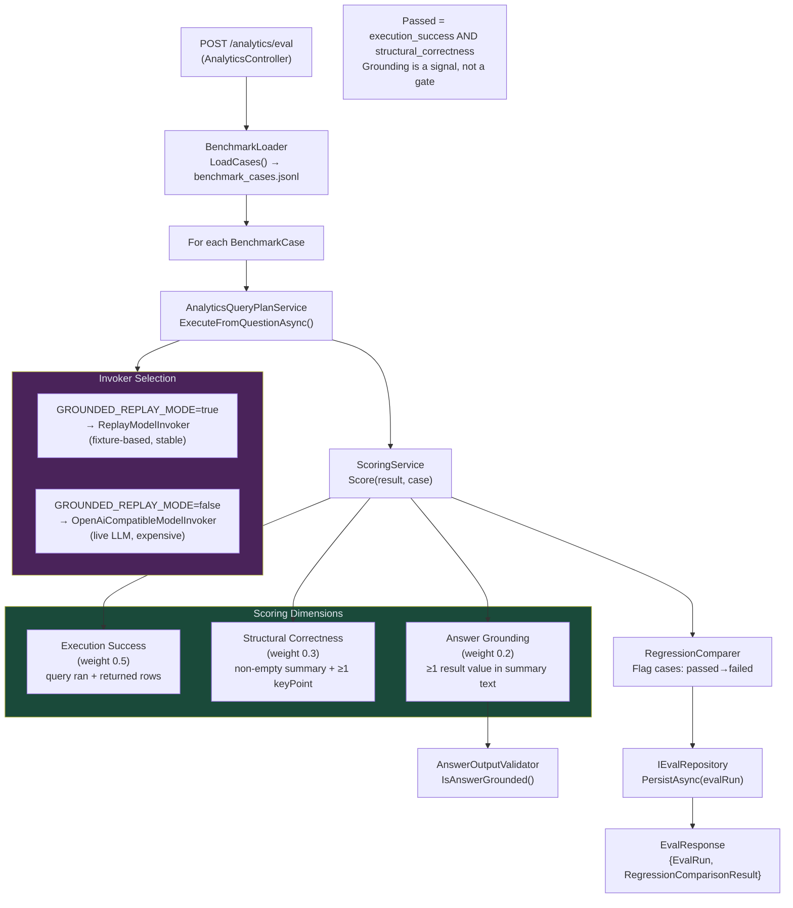

# Eval Pipeline Diagram

`POST /analytics/eval` runs all benchmark cases through the live pipeline and scores each one.

## Scoring Formula

| Dimension | Weight | Gate? | Description |
|---|---|---|---|
| Execution success | 0.50 | Yes | Query ran without error and returned ≥1 row |
| Structural correctness | 0.30 | Yes | Non-empty `summary` and ≥1 `keyPoint` present |
| Answer grounding | 0.20 | No (signal) | ≥1 scalar value from result rows appears in `summary` |

**Pass condition**: `execution_success AND structural_correctness`
A case can pass without perfect grounding; the score reflects the grounding gap.
