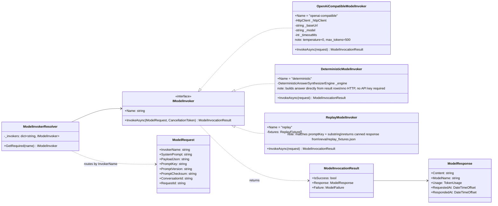
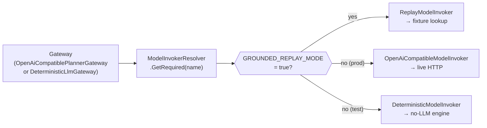

# Model Invoker Abstraction

The `IModelInvoker` strategy pattern decouples gateways from HTTP, enabling deterministic
tests and replay-based eval without network calls.

```mermaid
classDiagram
    direction LR

    class IModelInvoker {
        <<interface>>
        +Name: string
        +InvokeAsync(ModelRequest, CancellationToken) ModelInvocationResult
    }

    class ModelInvokerResolver {
        -_invokers: dict~string, IModelInvoker~
        +GetRequired(name) IModelInvoker
    }

    class OpenAiCompatibleModelInvoker {
        +Name = "openai-compatible"
        -HttpClient _httpClient
        -string _baseUrl
        -string _model
        -int _timeoutMs
        +InvokeAsync(request) ModelInvocationResult
        note: temperature=0, max_tokens=500
    }

    class DeterministicModelInvoker {
        +Name = "deterministic"
        -DeterministicAnswerSynthesizerEngine _engine
        +InvokeAsync(request) ModelInvocationResult
        note: builds answer directly from result rows\nno HTTP, no API key required
    }

    class ReplayModelInvoker {
        +Name = "replay"
        -fixtures: ReplayFixture[]
        +InvokeAsync(request) ModelInvocationResult
        note: matches promptKey + substring\nreturns canned response from\neval/replay_fixtures.json
    }

    class ModelRequest {
        +InvokerName: string
        +SystemPrompt: string
        +PayloadJson: string
        +PromptKey: string
        +PromptVersion: string
        +PromptChecksum: string
        +ConversationId: string
        +RequestId: string
    }

    class ModelInvocationResult {
        +IsSuccess: bool
        +Response: ModelResponse
        +Failure: ModelFailure
    }

    class ModelResponse {
        +Content: string
        +ModelName: string
        +Usage: TokenUsage
        +RequestedAt: DateTimeOffset
        +RespondedAt: DateTimeOffset
    }

    IModelInvoker <|.. OpenAiCompatibleModelInvoker
    IModelInvoker <|.. DeterministicModelInvoker
    IModelInvoker <|.. ReplayModelInvoker
    ModelInvokerResolver --> IModelInvoker
    ModelInvokerResolver ..> ModelRequest : routes by InvokerName
    IModelInvoker ..> ModelInvocationResult : returns
    ModelInvocationResult --> ModelResponse
```

## Selection Logic

```mermaid
flowchart LR
    GW["Gateway\n(OpenAiCompatiblePlannerGateway\nor DeterministicLlmGateway)"]
    MIR["ModelInvokerResolver\n.GetRequired(name)"]
    ENV{{"GROUNDED_REPLAY_MODE\n= true?"}}
    OAI["OpenAiCompatibleModelInvoker\n→ live HTTP"]
    REP["ReplayModelInvoker\n→ fixture lookup"]
    DET["DeterministicModelInvoker\n→ no-LLM engine"]

    GW --> MIR
    MIR --> ENV
    ENV -->|"yes"| REP
    ENV -->|"no (prod)"| OAI
    ENV -->|"no (test)"| DET
```
