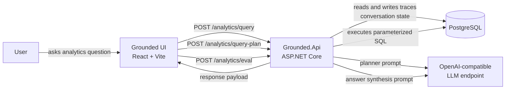
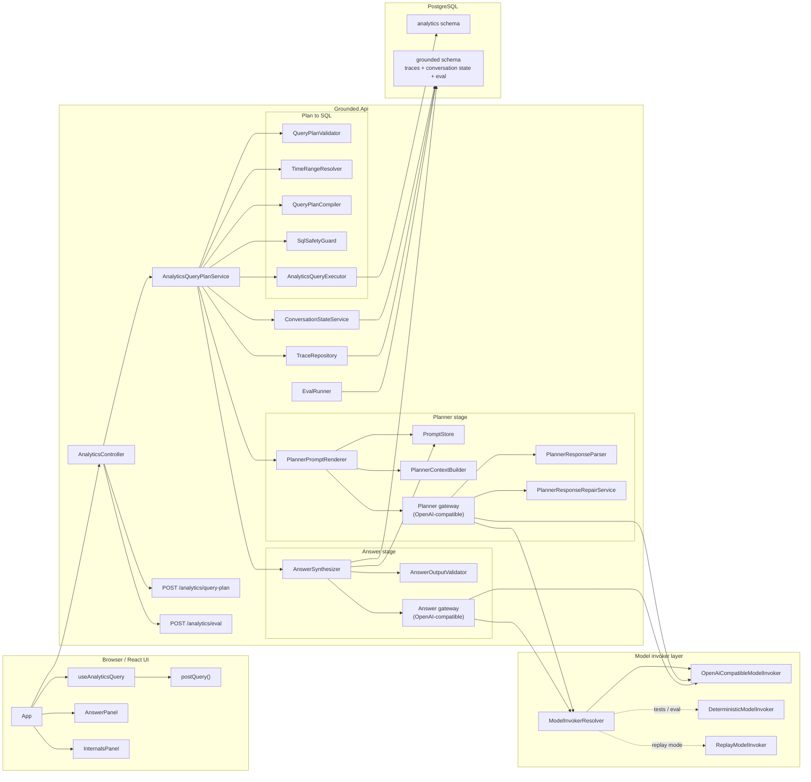
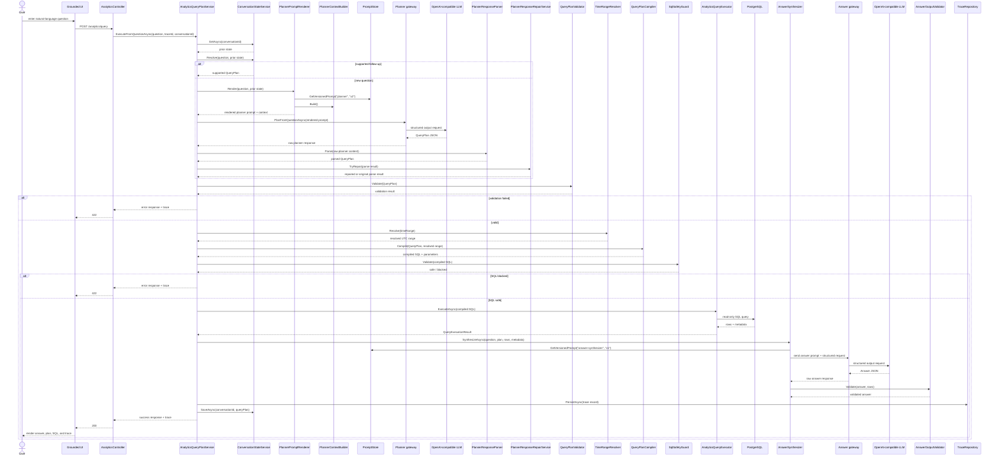
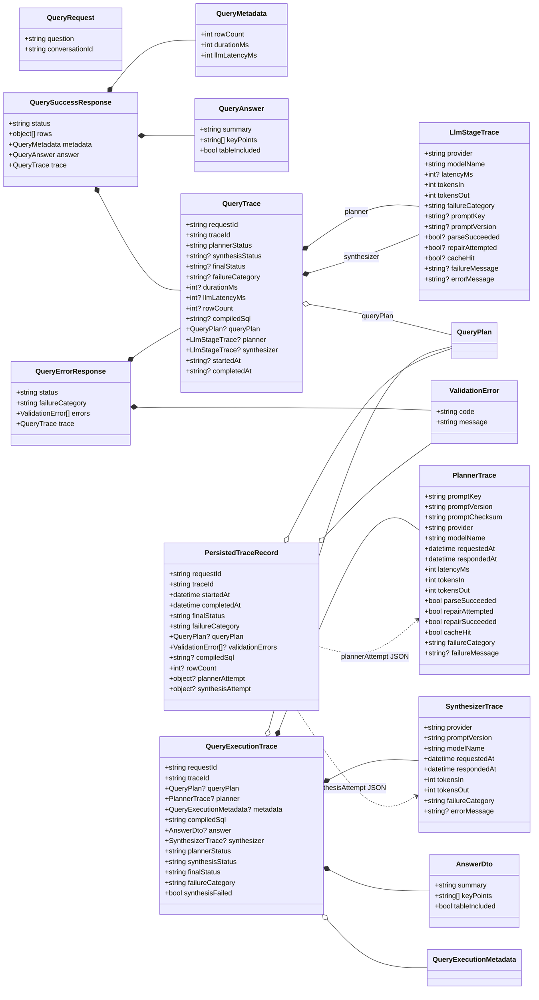

# Diagrams

## System Context Diagram

```mermaid
flowchart LR
    User[User]
    UI[Grounded UI\nReact + Vite]
    API[Grounded.Api\nASP.NET Core]
    DB[(PostgreSQL)]
    LLM[OpenAI-compatible\nLLM endpoint]

    User -->|asks analytics question| UI
    UI -->|POST /analytics/query| API
    UI -->|POST /analytics/query-plan| API
    UI -->|POST /analytics/eval| API

    API -->|reads and writes traces\nconversation state| DB
    API -->|executes parameterized SQL| DB
    API -->|planner prompt| LLM
    API -->|answer synthesis prompt| LLM
    API -->|response payload| UI
```

## Component Architecture

```mermaid
flowchart LR
    subgraph Browser["Browser / React UI"]
        App["App"]
        Hook["useAnalyticsQuery"]
        Post["postQuery()"]
        AnswerPanel["AnswerPanel"]
        InternalsPanel["InternalsPanel"]
        App --> Hook --> Post
        App --> AnswerPanel
        App --> InternalsPanel
    end

    subgraph Api["Grounded.Api"]
        Controller["AnalyticsController"]
        Orchestrator["AnalyticsQueryPlanService"]
        Conversation["ConversationStateService"]

        subgraph Planner["Planner stage"]
            PromptStore["PromptStore"]
            PromptRenderer["PlannerPromptRenderer"]
            ContextBuilder["PlannerContextBuilder"]
            PlannerGateway["Planner gateway\n(OpenAI-compatible)"]
            PlannerParser["PlannerResponseParser"]
            PlannerRepair["PlannerResponseRepairService"]
        end

        subgraph Compile["Plan to SQL"]
            Validator["QueryPlanValidator"]
            TimeRange["TimeRangeResolver"]
            Compiler["QueryPlanCompiler"]
            Safety["SqlSafetyGuard"]
            Executor["AnalyticsQueryExecutor"]
        end

        subgraph Answer["Answer stage"]
            AnswerSynth["AnswerSynthesizer"]
            AnswerValidator["AnswerOutputValidator"]
            AnswerGateway["Answer gateway\n(OpenAI-compatible)"]
        end

        TraceRepo["TraceRepository"]
        EvalRunner["EvalRunner"]
        QueryPlanEndpoint["POST /analytics/query-plan"]
        EvalEndpoint["POST /analytics/eval"]
    end

    subgraph Invokers["Model invoker layer"]
        Resolver["ModelInvokerResolver"]
        OpenAIInvoker["OpenAiCompatibleModelInvoker"]
        DeterministicInvoker["DeterministicModelInvoker"]
        ReplayInvoker["ReplayModelInvoker"]
    end

    subgraph Data["PostgreSQL"]
        AnalyticsSchema["analytics schema"]
        GroundedSchema["grounded schema\ntraces + conversation state + eval"]
    end

    App --> Controller
    Controller --> Orchestrator
    Controller --> QueryPlanEndpoint
    Controller --> EvalEndpoint

    Orchestrator --> Conversation
    Orchestrator --> PromptRenderer
    Orchestrator --> Validator
    Orchestrator --> TimeRange
    Orchestrator --> Compiler
    Orchestrator --> Safety
    Orchestrator --> Executor
    Orchestrator --> AnswerSynth
    Orchestrator --> TraceRepo

    PromptRenderer --> PromptStore
    PromptRenderer --> ContextBuilder
    PromptRenderer --> PlannerGateway
    PlannerGateway --> PlannerParser
    PlannerGateway --> PlannerRepair
    PlannerGateway --> Resolver

    AnswerSynth --> PromptStore
    AnswerSynth --> AnswerValidator
    AnswerSynth --> AnswerGateway
    AnswerGateway --> Resolver

    Resolver --> OpenAIInvoker
    Resolver -. tests / eval .-> DeterministicInvoker
    Resolver -. replay mode .-> ReplayInvoker

    Executor --> AnalyticsSchema
    Conversation --> GroundedSchema
    TraceRepo --> GroundedSchema
    EvalRunner --> GroundedSchema
    AnswerSynth --> GroundedSchema
    PlannerGateway --> OpenAIInvoker
    AnswerGateway --> OpenAIInvoker
```

## Request Pipeline

```mermaid
sequenceDiagram
    actor User
    participant UI as Grounded UI
    participant Controller as AnalyticsController
    participant Service as AnalyticsQueryPlanService
    participant Conversation as ConversationStateService
    participant Renderer as PlannerPromptRenderer
    participant Context as PlannerContextBuilder
    participant PromptStore as PromptStore
    participant PlannerGW as Planner gateway
    participant PlannerLLM as OpenAI-compatible LLM
    participant Parser as PlannerResponseParser
    participant Repair as PlannerResponseRepairService
    participant Validator as QueryPlanValidator
    participant TimeRange as TimeRangeResolver
    participant Compiler as QueryPlanCompiler
    participant Safety as SqlSafetyGuard
    participant Executor as AnalyticsQueryExecutor
    participant DB as PostgreSQL
    participant AnswerSynth as AnswerSynthesizer
    participant AnswerGW as Answer gateway
    participant AnswerLLM as OpenAI-compatible LLM
    participant AnswerVal as AnswerOutputValidator
    participant TraceRepo as TraceRepository

    User->>UI: enter natural-language question
    UI->>Controller: POST /analytics/query
    Controller->>Service: ExecuteFromQuestionAsync(question, traceId, conversationId)

    Service->>Conversation: GetAsync(conversationId)
    Conversation-->>Service: prior state
    Service->>Conversation: Resolve(question, prior state)

    alt supported follow-up
        Conversation-->>Service: supported QueryPlan
    else new question
        Service->>Renderer: Render(question, prior state)
        Renderer->>PromptStore: GetVersionedPrompt("planner", "v2")
        Renderer->>Context: Build()
        Renderer-->>Service: rendered planner prompt + context
        Service->>PlannerGW: PlanFromQuestionAsync(rendered prompt)
        PlannerGW->>PlannerLLM: structured output request
        PlannerLLM-->>PlannerGW: QueryPlan JSON
        PlannerGW-->>Service: raw planner response
        Service->>Parser: Parse(raw planner content)
        Parser-->>Service: parsed QueryPlan
        Service->>Repair: TryRepair(parse result)
        Repair-->>Service: repaired or original parse result
    end

    Service->>Validator: Validate(QueryPlan)
    Validator-->>Service: validation result

    alt validation failed
        Service-->>Controller: error response + trace
        Controller-->>UI: 422
    else valid
        Service->>TimeRange: Resolve(timeRange)
        TimeRange-->>Service: resolved UTC range
        Service->>Compiler: Compile(QueryPlan, resolved range)
        Compiler-->>Service: compiled SQL + parameters
        Service->>Safety: Validate(compiled SQL)
        Safety-->>Service: safe / blocked

        alt SQL blocked
            Service-->>Controller: error response + trace
            Controller-->>UI: 422
        else SQL safe
            Service->>Executor: ExecuteAsync(compiled SQL)
            Executor->>DB: read-only SQL query
            DB-->>Executor: rows + metadata
            Executor-->>Service: QueryExecutionResult

            Service->>AnswerSynth: SynthesizeAsync(question, plan, rows, metadata)
            AnswerSynth->>PromptStore: GetVersionedPrompt("answer-synthesizer", "v1")
            AnswerSynth->>AnswerGW: send answer prompt + structured request
            AnswerGW->>AnswerLLM: structured output request
            AnswerLLM-->>AnswerGW: Answer JSON
            AnswerGW-->>AnswerSynth: raw answer response
            AnswerSynth->>AnswerVal: Validate(answer, rows)
            AnswerVal-->>AnswerSynth: validated answer

            Service->>TraceRepo: PersistAsync(trace record)
            Service->>Conversation: SaveAsync(conversationId, queryPlan)
            Service-->>Controller: success response + trace
            Controller-->>UI: 200
            UI-->>User: render answer, plan, SQL, and trace
        end
    end
```

## Trace Contracts

```mermaid
classDiagram
    direction LR

    class QueryRequest {
        +string question
        +string conversationId
    }

    class QueryMetadata {
        +int rowCount
        +int durationMs
        +int llmLatencyMs
    }

    class QueryAnswer {
        +string summary
        +string[] keyPoints
        +bool tableIncluded
    }

    class LlmStageTrace {
        +string provider
        +string modelName
        +int? latencyMs
        +int tokensIn
        +int tokensOut
        +string failureCategory
        +string? promptKey
        +string? promptVersion
        +bool? parseSucceeded
        +bool? repairAttempted
        +bool? cacheHit
        +string? failureMessage
        +string? errorMessage
    }

    class QueryTrace {
        +string requestId
        +string traceId
        +string plannerStatus
        +string? synthesisStatus
        +string? finalStatus
        +string? failureCategory
        +int? durationMs
        +int? llmLatencyMs
        +int? rowCount
        +string? compiledSql
        +QueryPlan? queryPlan
        +LlmStageTrace? planner
        +LlmStageTrace? synthesizer
        +string? startedAt
        +string? completedAt
    }

    class QuerySuccessResponse {
        +string status
        +object[] rows
        +QueryMetadata metadata
        +QueryAnswer answer
        +QueryTrace trace
    }

    class ValidationError {
        +string code
        +string message
    }

    class QueryErrorResponse {
        +string status
        +string failureCategory
        +ValidationError[] errors
        +QueryTrace trace
    }

    class AnswerDto {
        +string summary
        +string[] keyPoints
        +bool tableIncluded
    }

    class PlannerTrace {
        +string promptKey
        +string promptVersion
        +string promptChecksum
        +string provider
        +string modelName
        +datetime requestedAt
        +datetime respondedAt
        +int latencyMs
        +int tokensIn
        +int tokensOut
        +bool parseSucceeded
        +bool repairAttempted
        +bool repairSucceeded
        +bool cacheHit
        +string failureCategory
        +string? failureMessage
    }

    class SynthesizerTrace {
        +string provider
        +string promptVersion
        +string modelName
        +datetime requestedAt
        +datetime respondedAt
        +int tokensIn
        +int tokensOut
        +string failureCategory
        +string? errorMessage
    }

    class QueryPlan {
    }

    class QueryExecutionMetadata {
    }

    class QueryExecutionTrace {
        +string requestId
        +string traceId
        +QueryPlan? queryPlan
        +PlannerTrace? planner
        +QueryExecutionMetadata? metadata
        +string compiledSql
        +AnswerDto? answer
        +SynthesizerTrace? synthesizer
        +string plannerStatus
        +string synthesisStatus
        +string finalStatus
        +string failureCategory
        +bool synthesisFailed
    }

    class PersistedTraceRecord {
        +string requestId
        +string traceId
        +datetime startedAt
        +datetime completedAt
        +string finalStatus
        +string failureCategory
        +QueryPlan? queryPlan
        +ValidationError[]? validationErrors
        +string? compiledSql
        +int? rowCount
        +object? plannerAttempt
        +object? synthesisAttempt
    }

    QuerySuccessResponse *-- QueryMetadata
    QuerySuccessResponse *-- QueryAnswer
    QuerySuccessResponse *-- QueryTrace
    QueryErrorResponse *-- ValidationError
    QueryErrorResponse *-- QueryTrace
    QueryTrace *-- LlmStageTrace : planner
    QueryTrace *-- LlmStageTrace : synthesizer
    QueryTrace o-- QueryPlan : queryPlan
    QueryExecutionTrace *-- PlannerTrace
    QueryExecutionTrace *-- SynthesizerTrace
    QueryExecutionTrace *-- AnswerDto
    QueryExecutionTrace o-- QueryPlan
    QueryExecutionTrace o-- QueryExecutionMetadata
    PersistedTraceRecord o-- QueryPlan
    PersistedTraceRecord o-- ValidationError
    PersistedTraceRecord ..> PlannerTrace : plannerAttempt JSON
    PersistedTraceRecord ..> SynthesizerTrace : synthesisAttempt JSON
```
